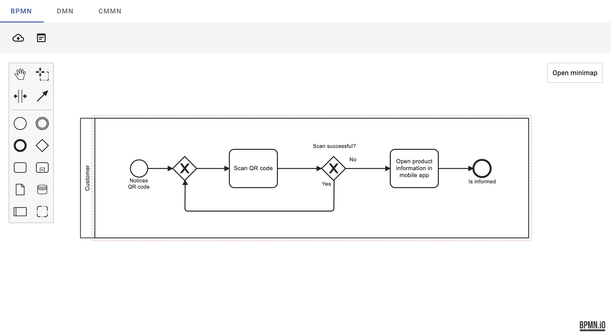
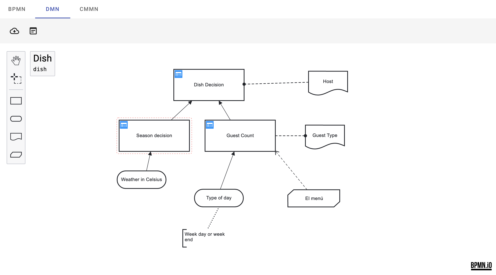
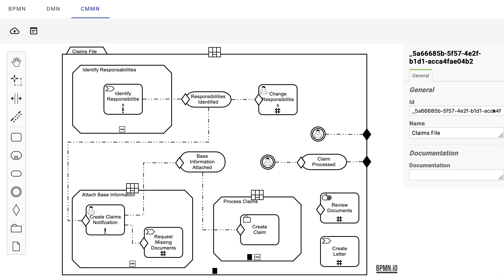

# Angular BPMN

Standalone BPMN components for your Angular applications.


## Prerequisites

- Angular 16.x (see also: [Angular Standalone Components](https://angular.io/guide/standalone-components))
- [Nx 16.x](https://nx.dev/getting-started/intro)
- Node.js 18x (or later)
- NPM 9x (or later)

## Installing

```sh
npm i @DenysVuika/ng-bpmn
```

## Basic Usage

```html
<ng-bpmn [url]="diagramUrl" [showProperties]="true" [showMinimap]="true" hotkeys="true" />

<ng-dmn [url]="diagramUrl" [showProperties]="true" [hotkeys]="true" />

<ng-cmmn [url]="diagramUrl" [showProperties]="true" [hotkeys]="true" />
```

## Components

Please refer to the component docs for more details and examples:

- [ng-bpmn](./libs/ng-bpmn/README.md)
- [ng-cmn](./libs/ng-bpmn/README.md)
- [ng-cmmn](./libs/ng-bpmn/README.md)

## Demo Application

Run `npm install` and `npm start` for a dev server. Navigate to <http://localhost:4200/>.
The app will automatically reload if you change any of the source files.

## BPMN



## DMN



## CMMN


