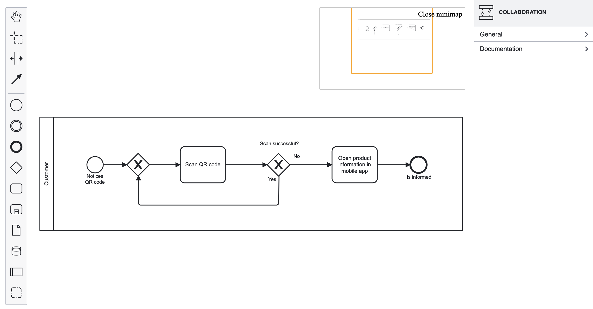

# Angular BPMN

Standalone BPMN components for your Angular applications.

## Prerequisites

- Angular 16.x (see also: [Angular Standalone Components](https://angular.io/guide/standalone-components))
- [Nx 16.x](https://nx.dev/getting-started/intro)
- Node.js 18x (or later)
- NPM 9x (or later)

## Components

- [ng-bpmn](./libs/ng-bpmn/README.md)
- [ng-cmn](./libs/ng-bpmn/README.md)

## Demo Application

Run `npm start` for a dev server. Navigate to <http://localhost:4200/>. The app will automatically reload if you change any of the source files.
