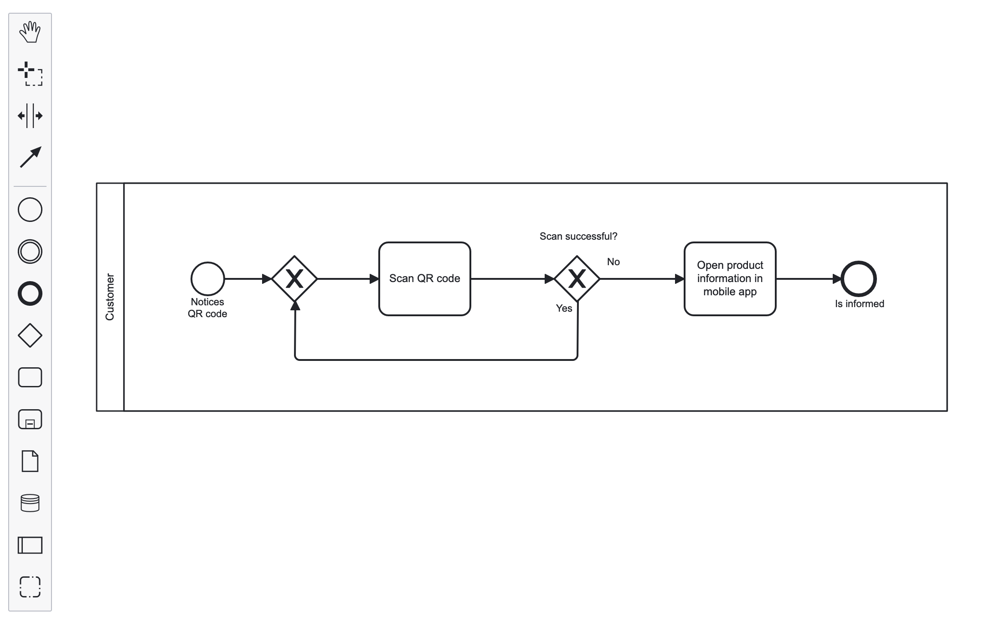
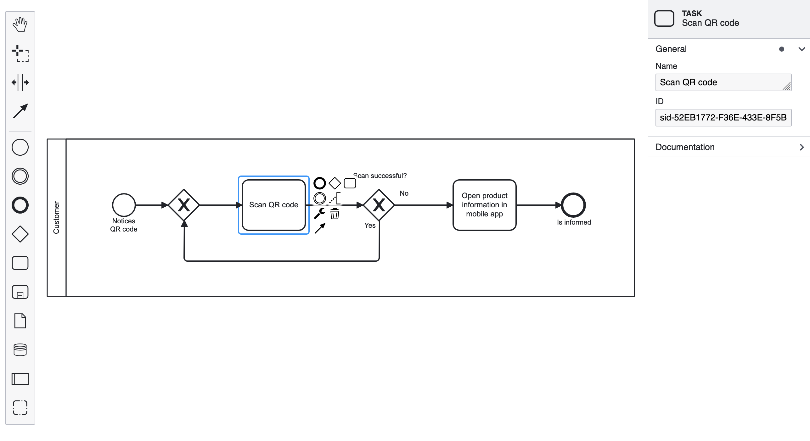

# Angular BPMN

Standalone BPMN components for your Angular applications.

## Getting Started

Install the dependency:

```sh
npm i @DenysVuika/ng-bpmn
```

Update `angular.json` (or `project.json`) and setup additional styles:

```json
{
  "targets": {
    "build": {
      "options": {
        "styles": [
          "node_modules/@DenysVuika/ng-bpmn/assets/diagram-js.css",
          "node_modules/@DenysVuika/ng-bpmn/assets/bpmn-js.css",
          "node_modules/@DenysVuika/ng-bpmn/assets/bpmn-font/css/bpmn.css",
          "node_modules/@DenysVuika/ng-bpmn/assets/properties-panel.css",
          "node_modules/@DenysVuika/ng-bpmn/assets/element-templates.css",
          "node_modules/@DenysVuika/ng-bpmn/assets/diagram-js-minimap.css"
          "./src/styles.scss"
        ]
      }
    }
  }
}
```

## BPMN

```html
<ng-bpmn [url]="diagramUrl" />
```



### Keyboard Hotkeys

```html
<ng-bpmn [url]="diagramUrl" [hotkeys]="true" />
```

Supported hotkeys:

| Keys | MacOS | Action |
| --- | --- | --- |
| `Ctrl`+`a` | `Command`+`a` | select all |
| `e` | `e` | direct editing |
| `h` | `h` | hand tool |
| `l` | `l` | lasso tool |
| `s` | `s` | space tool |
| `c` | `c` | global connect tool |
| `Ctrl`+`=` | `Command`+`=` | zoom in |
| `Ctrl`+`-` | `Command`+`-` | zoom out |
| `Ctrl`+`0` | `Command`+`0` | reset zoom |
| `Ctrl`+`9` | `Command`+`9` | zoom to fit |
| `Ctrl`+`z` | `Command`+`z` | undo |
| `Ctrl`+`Shift`+`z` | `Command`+`Shift`+`z` | redo |
| `Backspace` | `Backspace` | remove selection |
| `Ctrl`+`c` | `Command`+`c` | copy selection |
| `Ctrl`+`v` | `Command`+`v` | paste |
| `Ctrl`+`x` | `Command`+`x` | cut selection |
| `Ctrl`+`f` | `Command`+`f` | find |

### Invoking Component API

You can get the reference to the `ng-bpmn` component, and pass to the underlying application code.

> For the sake of simplicity, some of the code was omitted.

`app.component.html`

```html
<ng-bpmn #bpmn [url]="diagramUrl" />
<button (click)="exportSVG(bpmn)">Export SVG</button>
```

`app.component.ts`

```ts
import { saveAs } from 'file-saver';

export class AppComponent {
  exportSVG(bpmnComponent: NgBpmnComponent) {
    bpmnComponent.saveXML().then((content) => {
      if (content) {
        const blob = new Blob([content]);
        saveAs(blob, 'diagram.xml');
      }
    });
  }
}
```

### Properties Panel

```html
<ng-bpmn [url]="diagramUrl" [showProperties]="true" />
```



### Minimap

```html
<ng-bpmn [url]="diagramUrl" [showProperties]="true" [showMinimap]="true" />
```


