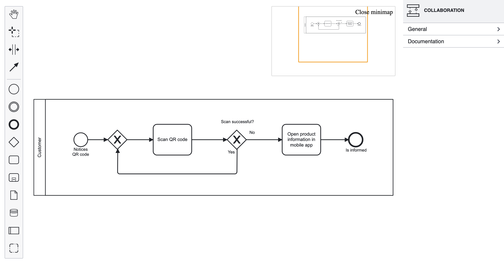

# Angular BPMN

Standalone BPMN components for your Angular applications.

## Getting Started

Install the dependency:

```sh
npm i @DenysVuika/ng-bpmn
```

Update `angular.json` (or `project.json`) and setup additional styles:

```json
{
  "targets": {
    "build": {
      "options": {
        "styles": [
          "node_modules/@DenysVuika/ng-bpmn/assets/diagram-js.css",
          "node_modules/@DenysVuika/ng-bpmn/assets/bpmn-js.css",
          "node_modules/@DenysVuika/ng-bpmn/assets/bpmn-font/css/bpmn.css",
          "node_modules/@DenysVuika/ng-bpmn/assets/properties-panel.css",
          "node_modules/@DenysVuika/ng-bpmn/assets/element-templates.css",
          "node_modules/@DenysVuika/ng-bpmn/assets/diagram-js-minimap.css"
          "./src/styles.scss"
        ]
      }
    }
  }
}
```

## Basic Usage

```html
<ng-bpmn [url]="diagramUrl" />
```


## Invoking Component API

You can get the reference to the `ng-bpmn` component, and pass to the underlying application code.

> For the sake of simplicity, some of the code was omitted.

`app.component.html`

```html
<ng-bpmn #bpmn [url]="diagramUrl" />
<button (click)="exportSVG(bpmn)">Export SVG</button>
```

`app.component.ts`

```ts
import { saveAs } from 'file-saver';

export class AppComponent {
  exportSVG(bpmnComponent: NgBpmnComponent) {
    bpmnComponent.saveXML().then((content) => {
      if (content) {
        const blob = new Blob([content]);
        saveAs(blob, 'diagram.xml');
      }
    });
  }
}
```

## Properties Panel

```html
<ng-bpmn [url]="diagramUrl" [showProperties]="true" />
```


## Minimap

```html
<ng-bpmn [url]="diagramUrl" [showProperties]="true" [showMinimap]="true" />
```


